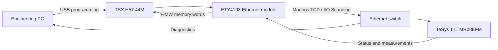

# TSX H57 / TeSys T Modbus TCP configuration and validation

**Noureddine Qarafi · ENSAM Meknès · OCP Jorf Lasfar**

A technical portfolio summary of an industrial communication project integrating a Schneider **TSX H57 44M** PLC with a **TeSys T LTMR08EFM** motor management controller through an **ETY4103 Ethernet module** using Modbus TCP.

The project covers hardware configuration, Ethernet addressing, I/O Scanning, PLC memory mapping, register monitoring, connectivity tests, and validation of the Modbus TCP service.

## Scope

- Configure the Schneider Premium rack in EcoStruxure Control Expert.
- Match the PLC project configuration to the installed TSX H57 44M hardware.
- Configure the ETY4103 Ethernet interface.
- Establish Modbus TCP communication with the TeSys T LTMR08EFM.
- Configure I/O Scanning for cyclic register acquisition.
- Map TeSys T status and measurement registers into PLC `%MW` words.
- Verify device reachability using ping tests.
- Verify availability of the TeSys T Modbus TCP service on port `502`.
- Prepare PLC variables for online monitoring and future supervision.

## Hardware and software

| Component | Reference / role |
| --- | --- |
| PLC | Schneider TSX H57 44M |
| Power supply | TSX PSY2600 |
| Ethernet module | TSX ETY4103 |
| Motor management controller | TeSys T LTMR08EFM |
| Network | Unmanaged Ethernet switch |
| Engineering software | EcoStruxure Control Expert |

## Network configuration used during testing

| Device | Address | Function |
| --- | --- | --- |
| TSX ETY4103 | `192.168.8.21` | Modbus TCP client / I/O Scanner |
| TeSys T LTMR08EFM | `192.168.8.54` | Modbus TCP server |
| Subnet mask | `255.255.255.0` | Local test subnet |
| Modbus TCP port | `502` | TeSys T communication service |
| Unit ID | `1` | I/O Scanner target |

The gateway was configured as `0.0.0.0` for the isolated local test network.

## I/O Scanning and PLC memory map

The ETY4103 periodically reads registers from the TeSys T and copies the received data into PLC memory.

### Status words

| TeSys T register | PLC word | Function |
| --- | --- | --- |
| `2502` | `%MW100` | System status 1 |
| `2503` | `%MW101` | System status 2 |
| `2504` | `%MW102` | Logic inputs |
| `2505` | `%MW103` | Logic outputs |

These registers contain bit-encoded states and require decoding using the applicable Schneider register definitions before being used in control or alarm logic.

### Current measurements

| TeSys T registers | PLC words | Value |
| --- | --- | --- |
| `500–501` | `%MW104–%MW105` | Average current |
| `502–503` | `%MW106–%MW107` | L1 current |
| `504–505` | `%MW108–%MW109` | L2 current |
| `506–507` | `%MW110–%MW111` | L3 current |

The documented scale for these current values is `× 0.01 A`.

Additional registers were also identified for future supervision, including thermal capacity, internal temperature, frequency, power factor, and active power.

## Validation

The communication path was checked in several stages:

1. The project was rebuilt in Control Expert and completed with **0 errors**.
2. The ETY4103 responded to ping requests at `192.168.8.21`.
3. The TeSys T responded to ping requests at `192.168.8.54`.
4. A TCP connection test to `192.168.8.54:502` returned `TcpTestSucceeded = True`.
5. I/O Scanner data was mapped into the PLC `%MW` memory area for online monitoring.

A successful ping confirms IP reachability, while the port test confirms that the Modbus TCP service accepts TCP connections. Correct data interpretation additionally depends on register mapping, word order, scaling, and online verification.

## Results and limitations

During the low-current test, the monitored average current was approximately **0.13 A**, and the TeSys T internal temperature was approximately **44 °C**.

The LTMR08EFM measurement range stated in the project report is **0.4–8 A**, so the 0.13 A value was below the specified range and was treated as an observed display value rather than a validated current measurement.

The implemented I/O Scanner entries used **write length = 0**, so this project focused on reading status and measurement data. Remote motor commands over Modbus TCP were outside the scope of the implementation.

## Troubleshooting points

| Symptom | Check |
| --- | --- |
| PLC transfer compatibility failure | Match the configured CPU version to the installed hardware |
| Ping failure | Check IP addresses, subnet mask, Ethernet cabling and switch connection |
| Ping works but Modbus remains unavailable | Check port `502`, Unit ID, server IP and I/O Scanner rows |
| Unexpected measurement values | Check register alignment, scaling, 32-bit word order and measurement range |
| PLC-to-PC upload unavailable | Confirm that upload information exists in the PLC project |

## Main tools and technologies

`EcoStruxure Control Expert` · `Modbus TCP` · `I/O Scanning` · `Schneider Premium PLC` · `TSX H57 44M` · `ETY4103` · `TeSys T LTMR08EFM` · `Industrial Ethernet`

## Français

Projet d'intégration d'un automate **Schneider TSX H57 44M** avec un contrôleur moteur **TeSys T LTMR08EFM** via **Modbus TCP**. Le travail comprend la configuration de l'ETY4103, l'adressage Ethernet, la mise en place de l'I/O Scanning, le mappage des registres TeSys T dans les mots `%MW` de l'automate, ainsi que la validation de la connectivité réseau et du service Modbus TCP sur le port 502.
